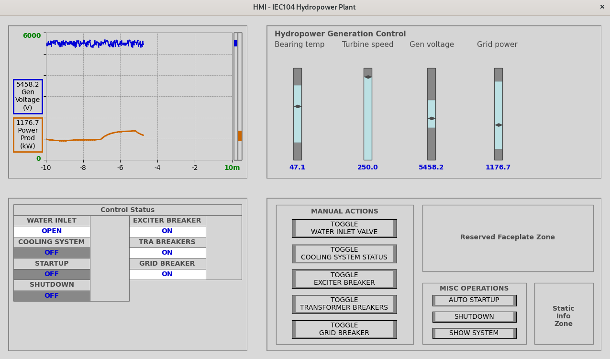
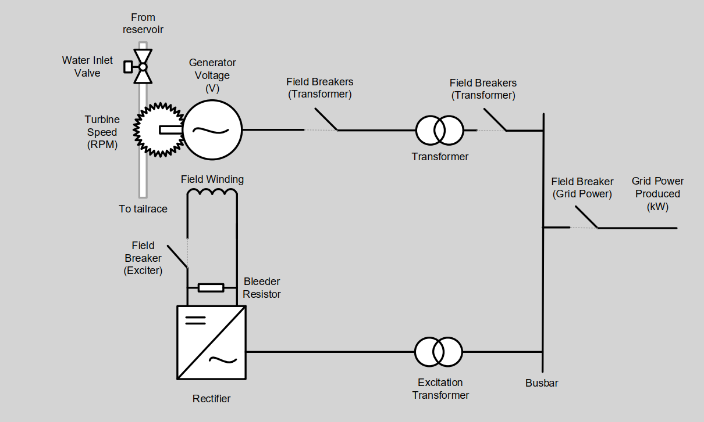

# HMI for Modbus TCP Operations

These files are meant to be used with the IEC104 server in `../Server/iec104_hydropower.py`. The interface allows users to control the simulated hydropower plant, and view real-time statuses using an interface based on high performance HMI concepts.

## Usage

To run the IEC104 server and HMI (acting as client) with default parameters, run these commands from HMI directory:
```shell
python3 ../Server/iec104_hydropower.py&
python3 main.py
```

For advanced usage, the HMI script `main.py` accepts several command line arguments:

- `--host`: Host IP address or hostname to connect to. Defaults to `127.0.0.1`.
- `-p, --port`: Set TCP port to connect to the Modbus server. The port number can be in the range 1 to 65535, either in decimal or hexadecimal format. Defaults to IEC104 port 2404.
- `-t, --timeout`: Set the connection timeout in seconds. The value should be a positive integer less than 120 seconds. Defaults to 5.

Example usage with command line arguments:
```shell
python3 main.py --host 192.168.1.100 -p 502 -t 10
```

## Dependencies

- `matplotlib`: This library facilitates the creation of the graphical components and visualization for the interface.
- `Pillow`: For image handling within the Tkinter interface.

Install with:
```shell
pip install -r requirements.txt
```

## HMI Interface

The HMI components:

- **Trend Graphs**: See historical values of generator voltage and grid power produced
- **Control Buttons**: Controls for toggling the operational state of water inlets, cooling systems, excitation, and more.
- **Status Indicators**: Displays the status the hydropower plant



System overview as a basis for the simulation:



