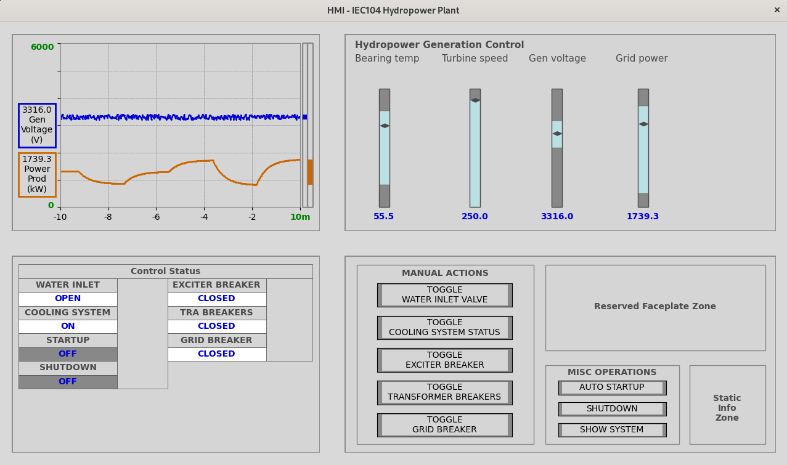

The background for the project is to create simulated IEC104 devices to generate network traffic and show operational technology (OT) process impacts for cybersecurity use cases.

This project contains a basic Python implementation of these parts:
* IEC104 Server simulating a hydropower plant
* Human-Machine Interface (HMI) using the c104 library for interacting with the IEC104 server

# Example of HMI in use:

# Dependencies

#### iec104-python

The library is used for 60870-5-104 protocol based communication.

[&raquo; Source code](https://github.com/Fraunhofer-FIT-DIEN/iec104-python)

[&raquo; Documentation](https://iec104-python.readthedocs.io/latest/index.html)

#### lib60870-C

This project is build on top of lib60870-C v2 from MZ Automation GmbH, which is licensed under [GPLv3](https://www.gnu.org/licenses/gpl-3.0.en.html).

The library is used for 60870-5-104 protocol based communication.

[&raquo; Source code](https://github.com/mz-automation/lib60870)

[&raquo; Documentation](https://support.mz-automation.de/doc/lib60870/latest/index.html)

#### mbedtls

This project is build on top of mbedtls from the Mbed TLS Contributors, which is licensed under [Apache-2.0](http://www.apache.org/licenses/LICENSE-2.0).

The library is used to add transport layer security to the 60870-5-104 protocol based communication.

[&raquo; Source code](https://github.com/Mbed-TLS/mbedtls)

[&raquo; Documentation](https://www.trustedfirmware.org/projects/mbed-tls/)

#### pybind11

This project is build on top of pybind11 from Wenzel Jakob, which is licensed under a [BSD-style license](https://github.com/pybind/pybind11/blob/master/LICENSE).

The library is used to wrap c++ code into a python module and allow seamless operability between python and c++.

[&raquo; Source code](https://github.com/pybind/pybind11)

[&raquo; Documentation](https://pybind11.readthedocs.io/en/stable/)

#### catch2

This project is build on top of catch2 from the Catch2 Authors, which is licensed under [BSL-1.0](https://www.boost.org/users/license.html).

The library is used as testing framework for test-automation.

[&raquo; Source code](https://github.com/catchorg/Catch2)

[&raquo; Documentation](https://github.com/catchorg/Catch2/blob/devel/docs/Readme.md)